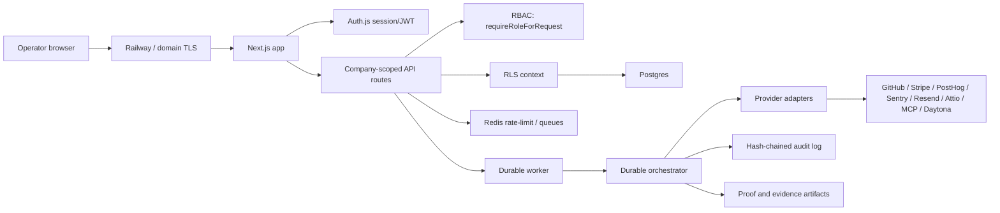
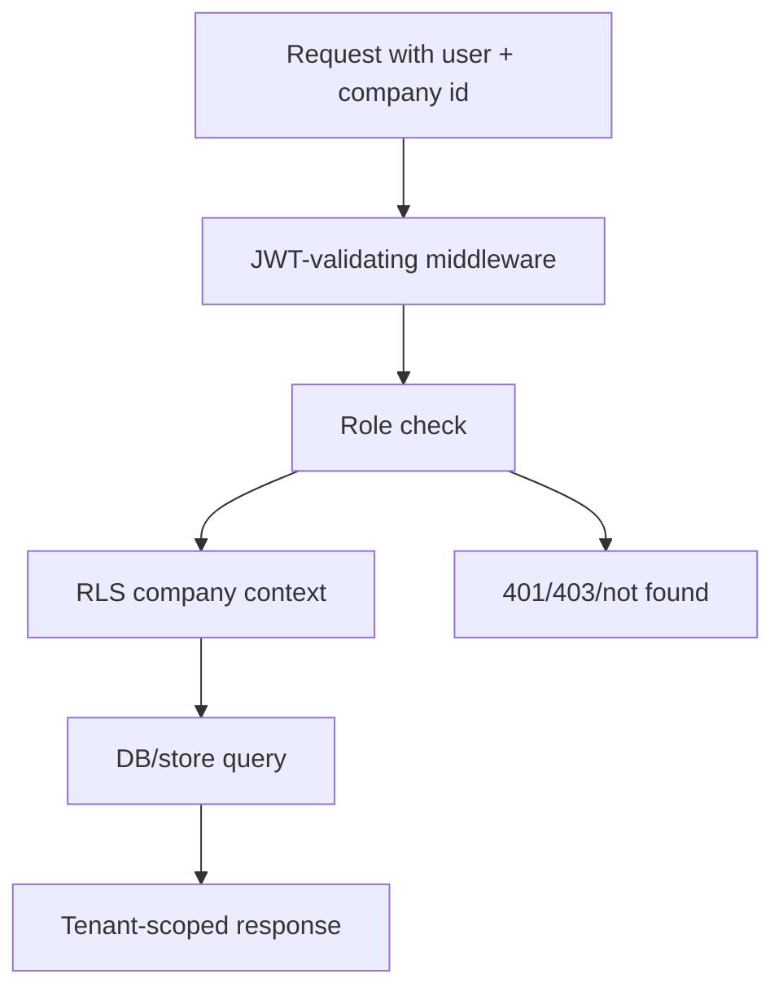
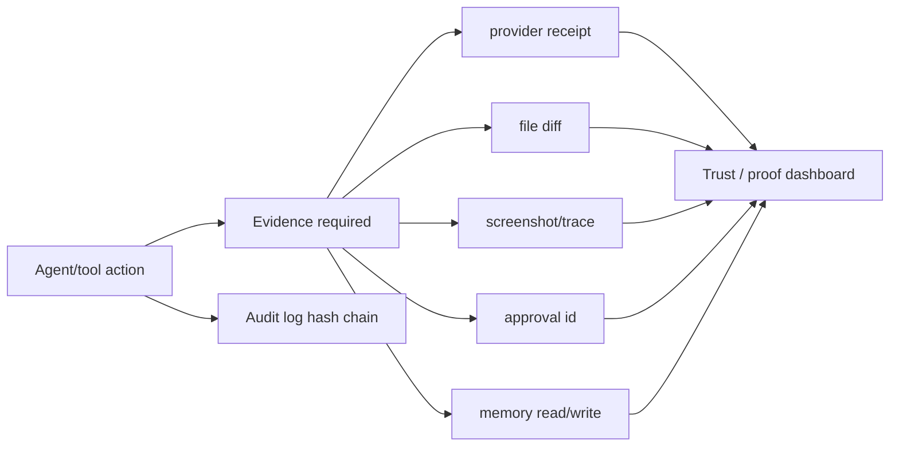

# Security And Reliability Architecture Overview

Date: 2026-06-20

## Runtime Boundary

## Tenant Boundary

## Evidence Boundary

## Failure Model

| Failure | Expected behavior |
|---|---|
| Unauthenticated request | 401 JSON for APIs; redirect for pages. |
| Missing role | 403 or not found depending on surface sensitivity. |
| Missing provider credential | `unavailable` or `needs_credentials`; no fake success. |
| Provider error | `failed` with recovery message; no claim without evidence. |
| Redis unavailable | Low-risk routes may fail open today; high-cost routes should be changed to fail closed. |
| Worker/SSE lost contact | UI falls back to polling durable run state. |
| Audit chain mismatch | Must be detected by scheduled verifier and escalated. |

## Gaps To Close

1. Route inventory guard for authz and validation.
2. Provider circuit breakers.
3. Explicit cache strategy.
4. DR runbook and RTO/RPO targets.
5. OpenAPI 3.1 contract generation or hand-maintained contract tests.
